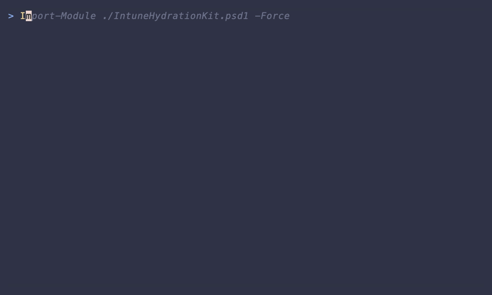

# Intune Hydration Kit

<p align="center">
  
</p>

<p align="center">
  <strong>Automate your Microsoft Intune tenant configuration with best-practice defaults</strong>
</p>

<p align="center">
  <a href="https://github.com/jorgeasaurus/IntuneHydrationKit/actions/workflows/ci.yml"></a>
  <a href="https://www.powershellgallery.com/packages/IntuneHydrationKit"></a>
  <a href="https://www.powershellgallery.com/packages/IntuneHydrationKit"></a>
  <a href="https://github.com/jorgeasaurus/IntuneHydrationKit/blob/main/LICENSE"></a>
  
  
</p>

<p align="center">
  <a href="https://github.com/jorgeasaurus/IntuneHydrationKit/stargazers"></a>
  <a href="https://github.com/jorgeasaurus/IntuneHydrationKit/commits/main"></a>
  <a href="https://github.com/jorgeasaurus/IntuneHydrationKit/releases/latest"></a>
</p>

<p align="center">
  <a href="#installation">Installation</a> •
  <a href="#quick-start">Quick Start</a> •
  <a href="#configuration">Configuration</a> •
  <a href="#safety-features">Safety Features</a> •
  <a href="#troubleshooting">Troubleshooting</a>
</p>

---

## Overview

The Intune Hydration Kit is a PowerShell module that bootstraps Microsoft Intune tenants with boilerplate configurations. It includes vetted [OpenIntuneBaseline](https://github.com/jorgeasaurus/OpenIntuneBaseline) policies, bundled CIS benchmark-derived policies from [IntuneBaselines](https://github.com/jorgeasaurus/IntuneBaselines), compliance policies, dynamic groups, and more—turning hours of manual configuration into a single command.

> **Note:** This kit uses a [maintained fork](https://github.com/jorgeasaurus/OpenIntuneBaseline) of the original [OpenIntuneBaseline](https://github.com/SkipToTheEndpoint/OpenIntuneBaseline) repository. OpenIntuneBaseline and CIS baseline content from [IntuneBaselines](https://github.com/jorgeasaurus/IntuneBaselines) are bundled with the module and periodically refreshed only after validation and testing, which prevents unplanned upstream changes from affecting your deployments.

### Demo

<p align="center">
  
</p>

### What Gets Created

| Category | Count | Description |
| ---------- | ------- | ------------- |
| Dynamic Groups | 50 | Device and user targeting groups (OS, manufacturer, Autopilot, ownership, VMs, license-based) |
| Static Groups | 5 | Update ring groups (Pilot, UAT) and Autopilot device preparation group |
| Device Filters | 24 | Platform, manufacturer, and VM-based filters (Windows, macOS, iOS, Android) |
| OpenIntuneBaseline | 94 | [OpenIntuneBaseline](https://github.com/jorgeasaurus/OpenIntuneBaseline) policies (Windows, macOS, iOS, Android) - bundled, no download required |
| CIS Baselines | 700+ | Bundled [IntuneBaselines](https://github.com/jorgeasaurus/IntuneBaselines) CIS benchmark-derived policies across Windows, macOS, iOS, Android, Edge, Chrome, and related administrative template workloads |
| Compliance Policies | 10 | Multi-platform compliance (Windows, macOS, iOS, Android, Linux) |
| App Protection | 8 | MAM policies following [Microsoft's App Protection Framework](https://learn.microsoft.com/en-us/intune/intune-service/apps/app-protection-framework) (Level 1-3 for iOS and Android) |
| Mobile Apps | 17 | Microsoft Store apps (Company Portal, Teams, Slack, Spotify, etc.) |
| Notification Templates | 1 | Notification message templates for compliance and enrollment |
| Enrollment Profiles | 4 | Autopilot deployment profiles, Enrollment Status Page, and Autopilot device preparation |
| Conditional Access | 21 | [Starter pack policy templates](https://learn.microsoft.com/en-us/entra/identity/conditional-access/concept-conditional-access-policy-common) (created disabled) |

---

## Important Warnings

> **⚠️ READ BEFORE USE**

### This Tool Can Modify Your Production Environment

- **Creates objects** in your Intune tenant (policies, groups, filters)
- **Can delete objects** when run with delete mode enabled
- **Modifies Conditional Access** policies (though always created disabled)

### Recommendations

1. **Test in a non-production tenant first** - Use a dev/test tenant before running against production
2. **Always preview changes first** - Use `-WhatIf` in parameter or settings mode
3. **Review the configuration** - Understand what will be imported before running
4. **Have a rollback plan** - Know how to manually remove configurations if needed
5. **Backup existing configurations** - Export current settings before running

### Deletion Safety

When using delete mode (`-Delete` parameter or `"delete": true` in settings), the kit will **only delete objects that it created**:

- Objects are identified by the `[IHD]` name prefix and `"Imported by Intune Hydration Kit"` description marker
- Conditional Access policies must also be in `disabled` state to be deleted
- Manually created objects with the same names will NOT be deleted

---

## Features

- **`[IHD]` Name Prefix** - All imported objects are prefixed with `[IHD]` for easy identification and filtering
- **Batch API Operations** - Groups, policies, filters, and apps use batched Graph API calls (up to 10 per batch) for ~61% faster execution
- **Retry-After Throttle Handling** - Automatic retry with `Retry-After` header support on 429/503 Graph API responses
- **Bundled Baselines** - OpenIntuneBaseline and CIS baseline templates are included in the module (no external download required)
- **Idempotent** - Safe to run multiple times; skips existing configurations
- **Dry-Run Mode** - Preview changes with PowerShell `-WhatIf` before applying
- **Safe Deletion** - Only removes objects created by this kit (identified by `[IHD]` prefix and description marker)
- **Multi-Platform** - Supports Windows, macOS, iOS, Android, and Linux
- **Platform Filtering** - Import resources for specific platforms only (e.g., `-Platform Windows,macOS`)
- **Detailed Logging** - Full audit trail of all operations
- **Elapsed Time Tracking** - Final summary output and reports include total hydration time
- **Summary Reports** - Markdown and JSON reports of all changes

---

## Prerequisites

### Required PowerShell Version

- PowerShell 7.0 or later

### Required Modules

```powershell
Install-Module Microsoft.Graph.Authentication -Scope CurrentUser
```

> **Note:** This module uses `Invoke-MgGraphRequest` for all Graph API calls, so only the Authentication module is required.

### Required Permissions

The authenticated user/app needs these Microsoft Graph permissions:

- `DeviceManagementConfiguration.ReadWrite.All`
- `DeviceManagementServiceConfig.ReadWrite.All`
- `DeviceManagementManagedDevices.ReadWrite.All`
- `DeviceManagementScripts.ReadWrite.All`
- `DeviceManagementApps.ReadWrite.All`
- `Group.ReadWrite.All`
- `Policy.Read.All`
- `Policy.ReadWrite.ConditionalAccess`
- `Application.Read.All`
- `Directory.ReadWrite.All`
- `LicenseAssignment.Read.All`
- `Organization.Read.All`

---

## Installation

### Option A: PowerShell Gallery (Recommended)

Install directly from the PowerShell Gallery:

```powershell
Install-Module -Name IntuneHydrationKit -Scope CurrentUser
```

To update to the latest version:

```powershell
Update-Module -Name IntuneHydrationKit
```

### Option B: Clone from GitHub

For development or to use the latest unreleased changes:

```powershell
git clone https://github.com/jorgeasaurus/IntuneHydrationKit.git
cd IntuneHydrationKit
Import-Module ./IntuneHydrationKit.psd1
```

---

## Quick Start

The kit supports two invocation methods: **parameters** (recommended) or **settings file** (for complex configurations).

### Using the PSGallery Module

After installing from PSGallery, use the `Invoke-IntuneHydration` function directly:

```powershell
# Preview all targets with interactive auth
Invoke-IntuneHydration -TenantId "your-tenant-id" `
    -Interactive `
    -Create `
    -All `
    -WhatIf

# Run specific targets only
Invoke-IntuneHydration -TenantId "your-tenant-id" `
    -Interactive `
    -Create `
    -ComplianceTemplates `
    -DynamicGroups `
    -DeviceFilters

# Import bundled CIS baseline policies only
Invoke-IntuneHydration -TenantId "your-tenant-id" `
    -Interactive `
    -Create `
    -CISBaselines

# Filter by platform (Windows only)
Invoke-IntuneHydration -TenantId "your-tenant-id" `
    -Interactive `
    -Create `
    -All `
    -Platform Windows

# Filter by multiple platforms
Invoke-IntuneHydration -TenantId "your-tenant-id" `
    -Interactive `
    -Create `
    -All `
    -Platform Windows, macOS

# Use service principal authentication
$secret = ConvertTo-SecureString "your-secret" -AsPlainText -Force
Invoke-IntuneHydration -TenantId "your-tenant-id" `
    -ClientId "app-id" `
    -ClientSecret $secret `
    -Create `
    -All

# Use a settings file for complex configurations
Invoke-IntuneHydration -SettingsPath ./settings.json

# Preview with settings file
Invoke-IntuneHydration -SettingsPath ./settings.json -WhatIf
```

### Using the Cloned Repository

If you cloned the repository, use the wrapper script:

```powershell
# Preview all targets with interactive auth
./Invoke-IntuneHydration.ps1 -TenantId "your-tenant-id" `
    -Interactive `
    -Create `
    -All `
    -WhatIf

# Run specific targets only
./Invoke-IntuneHydration.ps1 -TenantId "your-tenant-id" `
    -Interactive `
    -Create `
    -ComplianceTemplates `
    -DynamicGroups `
    -DeviceFilters

# Import bundled CIS baseline policies only
./Invoke-IntuneHydration.ps1 -TenantId "your-tenant-id" `
    -Interactive `
    -Create `
    -CISBaselines

# Filter by platform (Windows and macOS only)
./Invoke-IntuneHydration.ps1 -TenantId "your-tenant-id" `
    -Interactive `
    -Create `
    -All `
    -Platform Windows, macOS

# Use service principal authentication
$secret = ConvertTo-SecureString "your-secret" -AsPlainText -Force
./Invoke-IntuneHydration.ps1 -TenantId "your-tenant-id" `
    -ClientId "app-id" `
    -ClientSecret $secret `
    -Create `
    -All
```

### Using a Settings File

For complex or repeated configurations, use a settings file:

#### 1. Create Your Settings File

```powershell
# If using cloned repo
Copy-Item settings.example.json settings.json

# If using PSGallery module, create your own settings.json
```

Edit `settings.json` with your tenant details:

```json
{
    "tenant": {
        "tenantId": "your-tenant-id-here",
        "tenantName": "yourtenant.onmicrosoft.com"
    },
    "authentication": {
        "mode": "interactive"
    },
    "options": {
        "dryRun": false,
        "create": true,
        "delete": false,
        "force": false
    }
}
```

#### 2. Preview Changes (Recommended First Step)

```powershell
# PSGallery module
Invoke-IntuneHydration -SettingsPath ./settings.json -WhatIf

# Cloned repo
./Invoke-IntuneHydration.ps1 -SettingsPath ./settings.json -WhatIf
```

#### 3. Run the Hydration

```powershell
# PSGallery module
Invoke-IntuneHydration -SettingsPath ./settings.json

# Cloned repo
./Invoke-IntuneHydration.ps1 -SettingsPath ./settings.json
```

---

## Configuration

### Settings File Options

#### Tenant Configuration

```json
"tenant": {
    "tenantId": "00000000-0000-0000-0000-000000000000",
    "tenantName": "contoso.onmicrosoft.com"
}
```

#### Authentication Modes

The kit supports two authentication methods:

| Method        | Use Case             | Requirements                        |
| ------------- | -------------------- | ----------------------------------- |
| Interactive   | Manual runs, testing | User with required permissions      |
| Client Secret | Automation, CI/CD    | App registration with client secret |

**Interactive (recommended for testing):**

```json
"authentication": {
    "mode": "interactive",
    "environment": "Global"
}
```

Uses browser-based login. Best for manual runs and initial testing.

**Client Secret (for automation):**

```json
"authentication": {
    "mode": "clientSecret",
    "clientId": "00000000-0000-0000-0000-000000000000",
    "clientSecret": "your-client-secret-value",
    "environment": "Global"
}
```

Uses app registration credentials. Best for unattended/automated runs.

> **Security Note:** Store client secrets securely. Consider using Azure Key Vault or environment variables instead of plaintext in settings files.

**Supported Cloud Environments:**

| Environment | Description |
| ------------- | ------------- |
| `Global` | Commercial/Public cloud (default) |
| `USGov` | US Government (GCC High) |
| `USGovDoD` | US Government (DoD) |
| `Germany` | Germany sovereign cloud |
| `China` | China sovereign cloud (21Vianet) |

#### Operation Modes

| Option | Description |
| -------- | ------------- |
| `dryRun` | Preview changes without applying (same as `-WhatIf`) |
| `create` | Create new configurations |
| `delete` | Delete existing kit-created configurations |
| `force` | Skip confirmation prompt when running delete mode |

**Create mode (default):**

```json
"options": {
    "create": true,
    "delete": false
}
```

**Delete mode (cleanup):**

```json
"options": {
    "create": false,
    "delete": true,
    "force": false
}
```

#### Selective Targets (create or delete)

Enable or disable specific configuration types (used for both create and delete workflows):

```json
"imports": {
    "openIntuneBaseline": true,
    "cisBaselines": true,
    "complianceTemplates": true,
    "appProtection": true,
    "notificationTemplates": true,
    "enrollmentProfiles": true,
    "dynamicGroups": true,
    "staticGroups": true,
    "deviceFilters": true,
    "conditionalAccess": true,
    "mobileApps": true
}
```

#### Platform Filtering

Filter imports by platform to only import resources for specific operating systems:

```json
"platforms": ["Windows", "macOS"]
```

**Available platforms:** `Windows`, `macOS`, `iOS`, `Android`, `Linux`, `All`

**Default:** `["All"]` (imports resources for all platforms)

**Affected resources:**

- OpenIntuneBaseline policies
- CIS baseline policies
- Compliance policies
- App Protection policies
- Device Filters
- Mobile Apps
- Enrollment Profiles

**Cross-platform resources (not filtered):**

- Dynamic Groups
- Static Groups
- Conditional Access policies
- Notification Templates

**Examples:**

```json
// Windows-only deployment
"platforms": ["Windows"]

// Windows and macOS
"platforms": ["Windows", "macOS"]

// Mobile platforms only
"platforms": ["iOS", "Android"]

// All platforms (default)
"platforms": ["All"]
```

---

## Command-Line Parameters

The kit supports two mutually exclusive invocation modes:

1. **Settings File Mode**: Use `-SettingsPath` to load all configuration from a JSON file
2. **Parameter Mode**: Use `-TenantId` with `-Interactive` or `-ClientId`/`-ClientSecret`

These modes cannot be combined - choose one or the other.

### Tenant Parameters (Parameter Mode Only)

| Parameter | Type | Description |
| ----------- | ------ | ------------- |
| `-TenantId` | String | Azure AD tenant ID (GUID). Required for parameter mode. |
| `-TenantName` | String | Tenant name for display purposes |

### Authentication Parameters (Parameter Mode Only)

| Parameter | Type | Description |
| ----------- | ------ | ------------- |
| `-Interactive` | Switch | Use interactive (browser-based) authentication |
| `-ClientId` | String | Application ID for service principal auth |
| `-ClientSecret` | SecureString | Client secret for service principal auth |
| `-Environment` | String | Cloud environment: `Global`, `USGov`, `USGovDoD`, `Germany`, `China` (default: Global) |

### Options Parameters (Parameter Mode Only)

| Parameter | Type | Description |
| ----------- | ------ | ------------- |
| `-Create` | Switch | Enable creation of configurations |
| `-Delete` | Switch | Enable deletion of kit-created objects |
| `-Force` | Switch | Skip confirmation when running in delete mode |
| `-VerboseOutput` | Switch | Enable verbose logging |
| `-WhatIf` | Switch | PowerShell built-in preview mode (applies to any parameter set) |

### Target Parameters (Parameter Mode Only)

| Parameter | Type | Description |
| ----------- | ------ | ------------- |
| `-All` | Switch | Enable all targets |
| `-OpenIntuneBaseline` | Switch | Process OpenIntuneBaseline policies |
| `-CISBaselines` | Switch | Process bundled CIS baseline policies |
| `-ComplianceTemplates` | Switch | Process compliance policies |
| `-AppProtection` | Switch | Process app protection policies |
| `-NotificationTemplates` | Switch | Process notification templates |
| `-EnrollmentProfiles` | Switch | Process Autopilot/ESP profiles |
| `-DynamicGroups` | Switch | Process dynamic groups |
| `-StaticGroups` | Switch | Process static (assigned) groups |
| `-DeviceFilters` | Switch | Process device filters |
| `-ConditionalAccess` | Switch | Process CA starter pack |
| `-MobileApps` | Switch | Process mobile app templates |

### Platform Filtering Parameter

| Parameter | Type | Description |
| ----------- | ------ | ------------- |
| `-Platform` | String[] | Filter imports by platform: `Windows`, `macOS`, `iOS`, `Android`, `Linux`, `All` (default: All) |

Affects: OpenIntuneBaseline, CISBaselines, ComplianceTemplates, AppProtection, DeviceFilters, MobileApps, EnrollmentProfiles. Cross-platform resources (DynamicGroups, StaticGroups, ConditionalAccess, NotificationTemplates) are not filtered.

There are no separate baseline source or download parameters. OpenIntuneBaseline and CIS baseline content are bundled with the module and updated through tested module releases.

### Reporting Parameters (Parameter Mode Only)

| Parameter | Type | Description |
| ----------- | ------ | ------------- |
| `-ReportOutputPath` | String | Output directory for reports |
| `-ReportFormats` | String[] | Report formats: `markdown`, `json` |

### Settings File Mode Parameter

| Parameter | Type | Description |
| ----------- | ------ | ------------- |
| `-SettingsPath` | String | Path to settings JSON file. Required for settings file mode. |
| `-WhatIf` | Switch | Preview mode (same as `dryRun: true` in settings) |

---

## Safety Features

### Hydration Marker

All objects created by this kit are identified by two markers:

1. **Name prefix:** `[IHD]` prepended to the display name (e.g., `[IHD] Windows - Default Compliance`)
2. **Description marker:**

```plaintext
Imported by Intune Hydration Kit
```

These markers are used to:

- Identify objects created by this tool at a glance
- Prevent deletion of manually-created objects
- Enable safe cleanup operations

### Conditional Access Protection

Conditional Access policies receive additional protection:

- **Always created in `disabled` state** - Never automatically enabled
- **Deletion requires disabled state** - Cannot delete enabled CA policies
- **Manual review required** - You must manually enable policies after review

### WhatIf Support (Preview Mode)

All operations support PowerShell `-WhatIf` preview mode in both parameter and settings modes:

```powershell
# Parameter mode
./Invoke-IntuneHydration.ps1 -TenantId "guid" -Interactive -Create -All -WhatIf

# Settings file mode
./Invoke-IntuneHydration.ps1 -SettingsPath ./settings.json -WhatIf
```

---

## Output and Reports

### Console Output

The script provides real-time progress with colored status indicators:

- `[i]` Info - Operation details
- `[!]` Warning - Non-fatal issues
- `Created:` - New object created
- `Skipped:` - Object already exists
- `Deleted:` - Object removed

At the end of each run, the final summary also includes the total elapsed runtime:

```plaintext
---------------- Summary ----------------
Created: 12 | Updated: 3 | Deleted: 0 | Skipped: 8 | Failed: 0
Elapsed: 00:04:27
Reports: /tmp/IntuneHydrationKit/Reports/Hydration-Summary.md
JSON:    /tmp/IntuneHydrationKit/Reports/Hydration-Summary.json
----------------------------------------
```

### Log Files

Detailed logs are written to an OS-appropriate temp directory:

| OS | Log Path |
| ---- | ---------- |
| Windows | `$env:TEMP\IntuneHydrationKit\Logs\` |
| macOS | `/var/folders/.../IntuneHydrationKit/Logs/` |
| Linux | `/tmp/IntuneHydrationKit/Logs/` |

```plaintext
hydration-20241127-143052.log
```

### Summary Reports

After each run, reports are generated in the OS temp directory (same location as logs):

| OS | Reports Path |
| ---- | -------------- |
| Windows | `$env:TEMP\IntuneHydrationKit\Reports\` |
| macOS | `/var/folders/.../IntuneHydrationKit/Reports/` |
| Linux | `/tmp/IntuneHydrationKit/Reports/` |

- `Hydration-Summary.md` - Human-readable markdown report
- `Hydration-Summary.json` - Machine-readable JSON for automation

Both report formats include the run start time, completion time, and total elapsed time.

You can specify a custom output path using the `-ReportOutputPath` parameter or `reporting.outputPath` in settings.

---

## Troubleshooting

### Common Issues

#### "The term 'Invoke-MgGraphRequest' is not recognized"

```powershell
# Install required modules
Install-Module Microsoft.Graph.Authentication -Force
```

#### "Insufficient privileges"

- Ensure you have Global Administrator or Intune Administrator role
- Check that all required Graph permissions are consented

#### "No active Intune license found"

- Verify Intune licenses are assigned in the tenant
- Check for INTUNE_A, INTUNE_EDU, or EMS license

#### Objects not being deleted

- Verify the object has the `[IHD]` name prefix and "Imported by Intune Hydration Kit" in its description
- For CA policies, ensure the policy is in `disabled` state

### Debug Mode

Enable verbose logging in settings:

```json
"options": {
    "verbose": true
}
```

Or use PowerShell's verbose preference:

```powershell
$VerbosePreference = "Continue"
./Invoke-IntuneHydration.ps1 -SettingsPath ./settings.json
```

---

## Project Structure

```plaintext
IntuneHydrationKit/
├── Invoke-IntuneHydration.ps1    # Wrapper script (backward compatibility)
├── IntuneHydrationKit.psd1       # Module manifest
├── IntuneHydrationKit.psm1       # Module loader
├── build.ps1                      # Build bootstrap script
├── IntuneHydrationKit.build.ps1  # InvokeBuild tasks
├── settings.example.json          # Example configuration
├── Public/                        # Exported functions
│   ├── Invoke-IntuneHydration.ps1 # Main orchestrator function
│   ├── Connect-IntuneHydration.ps1
│   ├── Import-IntuneBaseline.ps1
│   ├── Import-IntuneCompliancePolicy.ps1
│   ├── Import-IntuneMobileApp.ps1
│   └── ...
├── Private/                       # Internal helper functions
│   ├── Invoke-GroupBatchImport.ps1 # Batch Graph API operations
│   ├── Get-GraphPagedResults.ps1   # Paginated Graph queries
│   ├── Get-TemplateDisplayNames.ps1
│   └── ...
├── Scripts/                       # Helper scripts
│   └── New-MobileAppTemplate.ps1  # Generate mobile app JSON templates
├── Templates/                     # Configuration templates
│   ├── OpenIntuneBaseline/        # Bundled OIB policies (94 templates)
│   ├── CISBaselines/              # Bundled CIS benchmark-derived policy content
│   ├── Compliance/
│   ├── ConditionalAccess/
│   ├── DynamicGroups/
│   ├── Filters/
│   ├── StaticGroups/
│   ├── MobileApps/
│   ├── Notifications/
│   └── ...
├── Tests/                         # Pester tests (648+)
├── Logs/                          # Execution logs
└── Reports/                       # Generated reports
```

---

## Changelog

See [CHANGELOG.md](CHANGELOG.md) for a detailed history of changes.

---

## Acknowledgments

- [OpenIntuneBaseline](https://github.com/SkipToTheEndpoint/OpenIntuneBaseline) by SkipToTheEndpoint - Original community-driven Intune security baselines (this kit uses a [maintained fork](https://github.com/jorgeasaurus/OpenIntuneBaseline) for stability)
- [IntuneBaselines](https://github.com/jorgeasaurus/IntuneBaselines) by jorgeasaurus - Source repository for the bundled CIS benchmark-derived policy content included with this kit
- Microsoft Graph PowerShell SDK team

---

## Disclaimer

This tool is provided "as-is" without warranty of any kind. Always test in a non-production environment first. The authors are not responsible for any unintended changes to your Intune tenant. Review all configurations before enabling in production.
